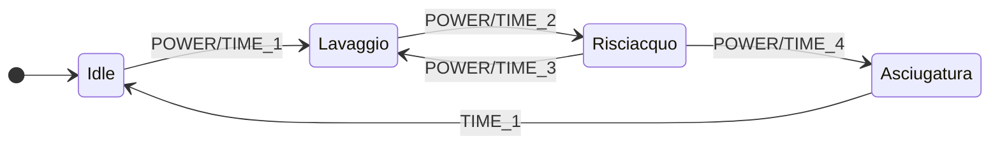

## 📱 FSM Lite - Automa a stati finiti per Elettrodomestici📣
<br>

| Requirements | Version |
| :---: | --- |
| [Elettrodomestici Smart Package](https://github.com/jumping2000/ha-packages/tree/main/elettrodomestici_2023) | > 2023.4.4 |


[](https://my.home-assistant.io/redirect/blueprint_import/?blueprint_url=https%3A%2F%2Fgithub.com%2Fjumping2000%2Fha-templates%2Fblob%2Fmain%2Fblueprints%2Fcn_fsm%2Fcn_fsm_appliances.yaml)

## FSM Lite for appliances - Last version 2023.10.2
This blueprint will use a FSM (finite state machine with 4 states) to simulate your appliance like washing machine, dishwasher, oven, dryer. It also offers a complete set of notification with Telegram, Companion app, Google Nest and Alexa and the fantastic "Centro Notifiche". Used by following Home Assistant packages :
1. [Washing Machine](https://github.com/jumping2000/ha-packages/blob/main/elettrodomestici_2023/elettrodomestici_2023.md)
2. [Dishwasher](https://github.com/jumping2000/ha-packages/blob/main/elettrodomestici_2023/elettrodomestici_2023.md)
3. [Oven](https://github.com/jumping2000/ha-packages/blob/main/elettrodomestici_2023/elettrodomestici_2023.md)
4. [Dryer](https://github.com/jumping2000/ha-packages/blob/main/elettrodomestici_2023/elettrodomestici_2023.md)

<br>

Il blueprint realizza una macchina a stati finiti (4 stati) che simula il comportamento di un elettrodomestico e invia un numero predefinito e configurabile di notifiche via Companion App, Telegram, Google Nest e Alexa, oltre al fantastico "Centro Notifiche". Da utilizzare, personalizzando le varie soglie di potenza, nei seguenti package:
1. [Lavatrice](https://github.com/jumping2000/ha-packages/blob/main/elettrodomestici_2023/elettrodomestici_2023.md)
2. [Lavastoviglie](https://github.com/jumping2000/ha-packages/blob/main/elettrodomestici_2023/elettrodomestici_2023.md)
3. [Forno](https://github.com/jumping2000/ha-packages/blob/main/elettrodomestici_2023/elettrodomestici_2023.md)
4. [Asciugatrice](https://github.com/jumping2000/ha-packages/blob/main/elettrodomestici_2023/elettrodomestici_2023.md)

In realtà è possibile usare il blueprint anche senza i packages indicati, basta eliminare le entità helper/template non necessarie oppure inserire nel proprio file configuration.yaml le entità necessarie, vediamo un esempio per quest'ultimo caso:

```yaml

  input_select:
    washing_machine_status:
      name: Stato Lavatrice
      options:
        - Idle
        - Lavaggio
        - Risciacquo
        - Svuotare
      initial: Idle

  template:
    - sensor:
      - name: washing_machine_status
        state: "{{ states('input_select.washing_machine_status') }}"

  counter:
    cicli_lavaggio_lavatrice:
      name: Cicli totali lavatrice
      step: 1
      restore: true
      icon: mdi:counter

```

Here a typical diagram / Diagramma degli stati:
<br>

<br><br>

**Ti piace questo blueprint? Lascia una stella ⭐ su Github e supportami per realizzarne altri!** <a href="https://www.buymeacoffee.com/jumping"></a>

[![Websitebadge]][website] [![Forum][forumbadge]][forum] [![telegrambadge]][telegram] [![facebookbadge]][facebook] 

<!-- ✨ _special_ ✨ -->
[website]: https://hassiohelp.eu/
[Websitebadge]: https://img.shields.io/website?down_message=Offline&label=HassioHelp&logoColor=blue&up_message=Online&url=https%3A%2F%2Fhassiohelp.eu

[telegram]: https://t.me/HassioHelp
[telegrambadge]: https://img.shields.io/badge/Chat-Telegram-blue?logo=Telegram

[facebook]: https://www.facebook.com/groups/2062381507393179/
[facebookbadge]: https://img.shields.io/badge/Group-Facebook-blue?logo=Facebook

[forum]: https://forum.hassiohelp.eu/
[forumbadge]: https://img.shields.io/badge/HassioHelp-Forum-blue?logo=data:image/png;base64,iVBORw0KGgoAAAANSUhEUgAAABgAAAAYCAYAAADgdz34AAAAGXRFWHRTb2Z0d2FyZQBBZG9iZSBJbWFnZVJlYWR5ccllPAAAA0ppVFh0WE1MOmNvbS5hZG9iZS54bXAAAAAAADw/eHBhY2tldCBiZWdpbj0i77u/IiBpZD0iVzVNME1wQ2VoaUh6cmVTek5UY3prYzlkIj8%2BIDx4OnhtcG1ldGEgeG1sbnM6eD0iYWRvYmU6bnM6bWV0YS8iIHg6eG1wdGs9IkFkb2JlIFhNUCBDb3JlIDUuNS1jMDIxIDc5LjE1NTc3MiwgMjAxNC8wMS8xMy0xOTo0NDowMCAgICAgICAgIj4gPHJkZjpSREYgeG1sbnM6cmRmPSJodHRwOi8vd3d3LnczLm9yZy8xOTk5LzAyLzIyLXJkZi1zeW50YXgtbnMjIj4gPHJkZjpEZXNjcmlwdGlvbiByZGY6YWJvdXQ9IiIgeG1sbnM6eG1wTU09Imh0dHA6Ly9ucy5hZG9iZS5jb20veGFwLzEuMC9tbS8iIHhtbG5zOnN0UmVmPSJodHRwOi8vbnMuYWRvYmUuY29tL3hhcC8xLjAvc1R5cGUvUmVzb3VyY2VSZWYjIiB4bWxuczp4bXA9Imh0dHA6Ly9ucy5hZG9iZS5jb20veGFwLzEuMC8iIHhtcE1NOkRvY3VtZW50SUQ9InhtcC5kaWQ6ODcxMjY2QzY5RUIzMTFFQUEwREVGQzE4OTI4Njk5NDkiIHhtcE1NOkluc3RhbmNlSUQ9InhtcC5paWQ6ODcxMjY2QzU5RUIzMTFFQUEwREVGQzE4OTI4Njk5NDkiIHhtcDpDcmVhdG9yVG9vbD0iQWRvYmUgUGhvdG9zaG9wIENDIDIwMTQgKFdpbmRvd3MpIj4gPHhtcE1NOkRlcml2ZWRGcm9tIHN0UmVmOmluc3RhbmNlSUQ9ImFkb2JlOmRvY2lkOnBob3Rvc2hvcDo0MWVhZDAwNC05ZWFmLTExZWEtOGY3ZS1mNzQ3Zjc1MjgyNGIiIHN0UmVmOmRvY3VtZW50SUQ9ImFkb2JlOmRvY2lkOnBob3Rvc2hvcDo0MWVhZDAwNC05ZWFmLTExZWEtOGY3ZS1mNzQ3Zjc1MjgyNGIiLz4gPC9yZGY6RGVzY3JpcHRpb24%2BIDwvcmRmOlJERj4gPC94OnhtcG1ldGE%2BIDw/eHBhY2tldCBlbmQ9InIiPz4xQPr3AAADq0lEQVR42rRVW2wMURj%2Bz5lL7V27KG26KIuUEJemdalu3VN3Ei/ipSWUuIV4FB4kHrwo8VLRROJBgkYElZCi4olG4rVoROOSbTa0u7pzO/6Z2Zmd3Z2uevBn/8zsf/7zff/tnKGMMRi/pjM6/j08oKiqCm1tbTA4OAhuoqkS8KKPVjceOcgJngkfnl%2B5JiWH0pQvcfUPhULQ0dEBPp8PDBZZlqGyshLGFKG0fHHr/QfNlxnbjFp7uOcl8VVVj%2BXu9XohkUgY2NRpdJMpc5qWN5971zu7ftsWkSAX2iKLYg3NZ/t6Kxbu2Oi2x4g8IxSKSDR2tLXh2JOn3nAkKv9GAzPtyigS%2BSdV1B3sejhv09lTxTBcCXjRK9buu96%2BZG/7dUYEryK59EXWewNcza7zl%2Br237kpessC4yIITIlGGk88666OtR6VMFKmZhZY9sGsdw1ATgFU1O7et%2Brki56JVUtqsl4kl0CVUjB57vo1Tad7X4Wj9U1S0vRj8HfRSQKVC5auPN7zctqiPTs1Rz2pBV6xcOuq%2BkOPusVAeZWxDg5wl%2Bhz1vW%2BpBFMDIYXt9y%2BF6lr2a6kR7IEmipDeFYsRkVewFcTyAXcBtNMhTxCTTErUxZdu96qLW8varhFsyrnQCQOYNXU8qBp//4TH/jkHZ3UCTXFoncQGKciP1SiN1JDVY2IJwgEjq3jYMVsZgC/HSBw9RnA8CgBjmS3MkdefE638sCV0WGQk9/QXYNRicH%2B7eWwYUGpOT4oq%2Bfq0Upw4SEPVOCLnwOWp5o%2BgskfWEoZe8Qg6CGwcp7XWFVxTc0UYdlMrLmQsP8zVuQcWFNiORFCTSvRQTWQs6W101SRXE7/xiDSBeC5BKywRLx/KqbuA44TYUQS4HHfsLHEcZyhulP32zjEUwL2ACuPt24%2BR0HhnONJBA8IoRlG/4P4/%2B57FTTyC9bUMAQk8OJ9Am69VsHjC2cOJbPaU0iQn4DxrjnSwVwp4eF2XwC63uBVLCchpXgQPAiUUrM8xBwlfeqs%2Bc7JwFn//KHKtAI8IkVejFgIgY8p2etEB7cPDbF32wSE8pwx926XTx6pAcPxxmFlzIo2o/qPy84sb4JTSMb7v3qiGFhJIaAzw1wbkmh8tu4IrqKm4v347V1qmvQGKvjJjEyf7v/pX3GmrGp%2BtT73UDyRHCPLMBDKwUj801dl4P7Fwc8fh0rLwiaBrp2dN2Do%2Bxfb%2Bd%2BE2GwEe%2BEPTYaW1gNQUiKaBP9T/ggwAJik5dEKYSC3AAAAAElFTkSuQmCC
